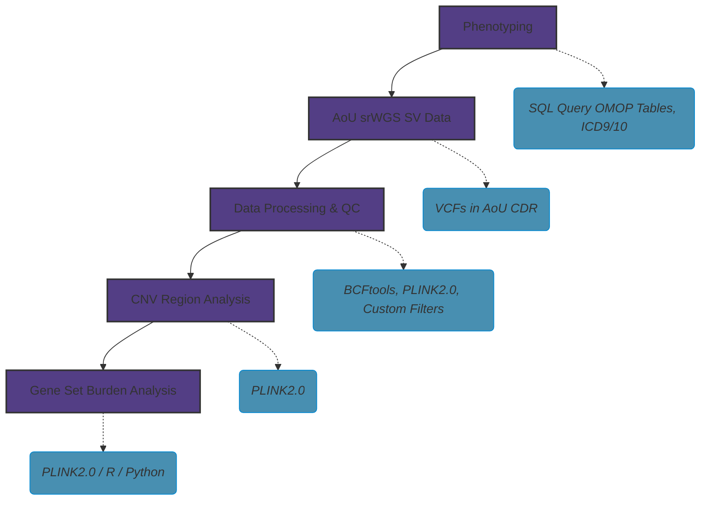

# AoU CNV Pipeline

<!--  -->

README updated: <i>May-28-2026</i> 

A bioinformatics pipeline designed for the **All of Us (AoU) Research Program** Workbench to detect, filter, and analyze Copy Number Variations (CNVs) from large-scale short-read Whole Genome Sequencing (srWGS) genomic data.

---

## Contents
- [Introduction](#introduction)
- [Pipeline Architecture](#pipeline-architecture)
- [Prerequisites & Setup](#prerequisites--setup)
- [Phenotyping](#phenotyping)
- [Data Processing](#data-processing)
- [CNV Region Analysis](#cnv-region-analysis)
- [Gene-set Burden Analysis](#gene-set-burden-analysis)
- [Usage Examples](#usage-examples)
- [Publications](#publications)
- [Citations](#citations)
- [License](#license)

---

## Introduction

This repository contains a bioinformatics pipeline specifically designed for detecting and analyzing **Copy Number Variations (CNVs)** from **short-read Whole Genome Sequencing (srWGS)** data within the **All of Us (AoU) Research Program** cloud environment. 

The pipeline includes three core analysis blocks:
* **Data Processing:** Plocessing srWGS structural variant calls, applies additional quality control metrics, and standardizes data formats for downstream analysis.
* **CNV Region Analysis:** Aggregating individual sample calls across the cohort to perform association testing of CNV Regions with pre-defined binary phenotype cohort.
* **Gene Set Analysis:** Functional annotation mapping of genomic coordinates of CNVs to reference GENCODE genes to perform gene-set enrichment analysis and identifying inplicated sets in a phenotype.

---
## Pipeline Architecture

---
## Prerequisites & Setup

To execute this pipeline successfully within the AoU Workbench, users should meet the following baseline conceptual and technical requirements:

### Conceptual Knowledge
* **AoU [CDRv8](https://support.researchallofus.org/hc/en-us/articles/30294451486356-Curated-Data-Repository-CDR-version-8-Release-Notes):** Basic understanding of the *All of Us* Cohort Data Repository environment.
* **OMOP CDM:** Elementary familiarity with the Observational Medical Outcomes Partnership Common Data Model tables, relationships, and structures.
* **SQL Querying:** Ability to query, extract, and structure Electronic Health Record (EHR) data using SQL.

### Technical Environment & Tools
Ensure your cloud environment is provisioned with a basic understanding of these environments and has the following runtimes and command-line tools available:
* **Languages:** Python (v3.10+) and R (v4.4+)
* **Command Line Tools:** 
  * [`BCFtools`](https://samtools.github.io/bcftools/bcftools.html) (for structural variant VCF manipulation)
  * [`PLINK 2.0`](https://www.cog-genomics.org/plink/2.0/) (for association testing and dosage analysis)

> **Note:** All steps and analyses are done in Researcher Workbench 1.0

---

## Phenotyping

There are two approaches to build the cohort: 

&emsp; **1. Building a Dataset with the Dataset Builder**

  The Dataset Builder is a point-and-click interface in the AoU Researcher Workbench that allows you to select and extract specific data for your study. Building a dataset involves a three-step workflow: selecting a concept set (a group of related medical concepts from a single data domain), defining your cohort, and selecting your values. 
    
  For step-by-step instructions, see the official [AoU Dataset Builder Documentation](https://support.researchallofus.org/hc/en-us/articles/4556645124244-Building-a-Dataset-with-the-Dataset-Builder).

&emsp; **2. Building a Dataset with SQL Query from OMOP Tables**

  For complex phenotyping and advanced cohort extraction, researchers can bypass the graphical UI and query the All of Us Curated Data Repository (CDR) directly via Google BigQuery within Jupyter Notebooks. This programmatic approach uses SQL to interact with the standard OHDSI OMOP Common Data Model (CDM) tables (such as `person`, `condition_occurrence`, `measurement`, and `drug_exposure`). It offers unmatched flexibility for building highly customized cohorts that require advanced logic, relational table joins, or strict temporal constraints.

  The polished production template for this framework is stored in the repository at:  
  [`01_phenotyping/01_SQL_phenotype_query.py`](01_phenotyping/01_SQL_phenotype_query.py)

  For detailed guidelines on relational mapping, schema definitions, and vocabulary tracking, see the official [AoU Understanding OMOP Basics Documentation](https://support.researchallofus.org/hc/en-us/articles/360039585391-Understanding-OMOP-Basics).

---

## Data Processing

### 1. Setup dsub and Google Cloud Virtual Machine (VM)

#### 1.1 dsub

Since all jobs must be run in the Google Cloud environment, users with Controlled Tier access are required to use `dsub` commands to process large volumes of data and run batch jobs. `dsub` is a command-line tool that simplifies submitting and running batch scripts in the cloud. With dsub, users can write shell scripts and submit them to a job scheduler directly from Jupyter notebooks. `dsub` supports Google Cloud as the backend batch job runner. Refer to the []`dsub documentation`](https://github.com/DataBiosphere/dsub) for additional guidance on writing dsub commands and examples of dsub scripts. Refer to the [`dsub Tutorial Notebook'](https://workbench.researchallofus.org/workspaces/aou-rw-6221d5ec/howtousedsubintheresearcherworkbenchv7/analysis) for more information on getting started with dsub.

To set up `dsub` and run batch jobs in the background within AoU, first run [`01_dsub_setup.sh`](/02_data_processing/01_dsub_setup.sh) script to configure `aou_dsub`.

**Note:** Working in the Google Cloud environment and running dsub jobs requires basic familiarity with Google Cloud concepts, including buckets, Docker, and Docker images.

#### 1.2 Virtual Machines (VMs) and cost
In order to manage job costs, it is important get familiar with different machines, analysis types and cost calculations. To mange costs consider following items:
  *  `--machine-type` : Specifies the Google Cloud virtual machine type to use for the job, including the number of CPUs and amount of memory (e.g., n1-standard-4). Please refer to [`google cloud pricing`](https://cloud.google.com/pricing/list?_gl=1*1gleqw1*_up*MQ..*_gs*MQ..&gclid=CjwKCAjwrNrQBhBjEiwAoR4VOyYRPRUNWdMzGJn9m226iwRXc7WV0b2b8wrGxFzOEyF41aCMyGz0KBoCE6MQAvD_BwE&gclsrc=aw.ds) for more information.
  *  `--disk-size` : Sets the size of the attached persistent storage disk (in GB) used for input/output data and intermediate files during job execution.
  *  `--boot-disk-size` : Defines the size of the VM boot disk (in GB), which stores the operating system and installed software required to run the job.

Cost Management

Selecting appropriate values for `--machine-type`, `--disk-size`, and `--boot-disk-size` helps optimize cloud computing costs by allocating only the resources needed for the job.

Job Parallelism

`dsub` supports running multiple jobs in parallel, which can significantly reduce total processing time for large-scale analyses, although increased parallelism may also increase overall cloud computing costs. Depending on the workflow, users can either submit multiple jobs simultaneously using separate VMs or run a single job on one VM and parallelize tasks internally within that VM.

### 2. Converting VCFs to PLINK Format

All VCF files need to be converted to PLINK files format (`.bed`, `.bim` and `.fam`) using [`02_VCF_to_PLINK_Format_conversion.py`](/02_data_processing/02_VCF_to_PLINK_Format_conversion.py)

### 3. Separating DEL and DUP CNVs

In this pipeline, deletions and duplications will be analyzed separtely and thus they need to be separated and generated DEL and DUP `.bim` files. Use [`03_separating_DELs_DUPs_bim.py](02_data_processing/03_separating_DELs_DUPs_bim.py) script to genarate the DEL- and DUP-specific CNV files.

### 4. Creating CNV Annotation Table

Users require annotation table for post analysis steps to annotate CNVs. It includes following information:

`chr`,	`start`,	`end`,	`ID`,	`ALT`,	`MAF`,	`length_bp`,	`cytoband`,	`gene_id`, `gene_name`,	`Gene_ID`,	`Gene_Name`,	`Gene_Start`,	`Gene_End`,	`Gene_Length`,	`cnv_gene_overlap_length`,	`cnv_gene_overlap_Pct`

In the separate annotation file, it includes
`QUAL`, `FILTER`, `AF`, `AC`, and gnomAD v4.1.0 allele frequencies (including joint and by ancestry groups AF). 

CNV coordinates, AF, AC and length are queried from sites only SV VCF file which can be found in AoU CDRv8 directory. Cytoband inforamtion are from [`UCSC database GoldenPath`](https://hgdownload.soe.ucsc.edu/goldenPath/hg38/database/). Genic information (gene names, genic intervals, gene length) are downloaded from [`GENCODE v46`](https://www.gencodegenes.org/human/release_46.html).

CNV Annotation table can be created using [`04_CNV_Annotation_Table.ipynb`](/02_data_processing/03_CNV_Annotation_Table.ipynb).

### 5. Sample QC: AoU Know Issues #10, Sex and Relatedness

Prior to downstream analysis, further QCs need to be applied. (A) First, samples with srWGS issues (N=4044) as mentions in the [`CDRv8 Genomic Quality Report`](https://support.researchallofus.org/hc/en-us/articles/29390274413716-All-of-Us-Genomic-Quality-Report) (Known Issue #10 pg. 72) needs to be removed as suggested. (B) Then, any sample sex discordant between self reported sex and DRAGEN Aneuploidy needs to be removed. It needs to compare the computed sex from DRAGEN against the self-reported sex assigned at birth and only included “male” and “female” in self-reported sex questionnaires without any mismatch with DRAGEN ploidy. Also, samples with abnormal DRAGEN ploidy needs to be removed. (C) In addition, samples identified and flagged as related were removed in accordance with the AoU genomic quality control guidelines to generate an unrelated study cohort for downstream analyses. These three steps can be applied using script [`05_additional_QC.ipynb`](/02_data_processing/05_additional_QC.ipynb).

---

## CNV Region Analysis

To analyze CNV regions, users should follow three steps.

### Step 1: Covariate Tables

For CNV region analysis, covariate tables must be generated, and analyses are performed separately for cases and controls. This can be done using two different approaches.

**Method 1**: Master Covariate Table

In this approach, a single master covariate table is generated for the entire dataset, including all required predictors. Separate `.txt` files containing the individual IDs for cases and controls are then created. Genome-wide association studies (GWAS) are subsequently performed using the `--keep` option in PLINK 2.0 to restrict analyses to the intended case or control cohort.

**Method 2**: Separate Covariate Tables

Alternatively, separate covariate tables can be generated for each cohort (cases and controls) instead of using a single master table. In this approach, the corresponding covariate table must be provided each time a GWAS analysis is run. 

The following predictors are included in the CNV region analysis:

* **Age**: Defined as the individual's age at the time of blood/saliva collection for genomic analysis. Sampling dates are obtained from the `genomic_metrics.tsv` file available in the [`CDRv8 directory`](https://support.researchallofus.org/hc/en-us/articles/29475233432212-Controlled-CDR-Directory) under the srWGS auxiliary files.

* **Sex**: Encoded as Male (`1`) and Female (`2`). Individuals with sex QC issues or discrepancies between self-reported sex and genomic sex are excluded, as described previously.

* **Principal Components (PCs)**: Ten principal components (PC1–PC10) are used for CNV region analysis. These PCs were generated in previous work by Singh et al. (2025) using the full AoU cohort. For trans-ancestry analyses, PCs were derived from POPMaD which includes AFR-like, AMR-like, CSA-like, EAS-like, EUR-like, MID-like, and OCE-like ancestry groups. For ancestry-specific analyses (e.g., EUR, AFR, and AMR), PCs generated using FlashPCA are used.

To generate covariate tables please refer to [`01_covariate_tables.py`](03_CNV_region_analysis/01_covariate_tables.py) script.

### Step 2: Modify `.fam` files

The `.fam` files generated during the VCF-to-PLINK conversion contain placeholder phenotype values. For association testing, PLINK requires the 6th column of the `.fam` file to correctly identify cases (`2`), controls (`1`), and unknown (`-9`) values. Because this pipeline performs ancestry-specific analyses, you must update the `.fam` files using the phenotypic data defined in your covariate tables. Use the [`02_modify_fam_files.py`](03_CNV_region_analysis/02_modify_fam_files.py) script to automate this mapping across all populations and chromosomes.

### Step 3: Run Firth's Logistic Regression

Once the `.fam` files are updated and covariates are prepared, perform the association analysis using **Firth’s penalized logistic regression**. This method is preferred for rare variant analysis (like CNVs) as it reduces bias caused by small sample sizes or unbalanced case-control ratios.

Run the analysis using `PLINK 2.0` with the `--glm firth` flag using covriate files generated in Step 1. Use this script to run GLM logistic regression analysis: [`03_firth_logistic_regression.py`](03_CNV_region_analysis/03_firth_logistic_regression.py)

### Step 4: Post GWAS Analysis and Visualization

After the parallelized Firth regression jobs complete, the results must be aggregated and validated. This step transforms raw PLINK outputs into results through the following workflow:

**4.1 Results Aggregation**
Since association testing is performed per chromosome and ancestry, the first task is to concatenate these individual outputs into a single "Summary Statistics" file for each analysis group (e.g., `EUR_DELs`, `EUR_DUPs`).

**4.2 Statistical Quality Control**
*   **Genomic Inflation Factor ($\lambda$):** We calculate $\lambda$ to assess potential systemic bias or population stratification. A $\lambda \approx 1$ indicates that the observed p-values follow the expected null distribution, while $\lambda > 1.1$ may suggest uncorrected stratification. $\lambda$1000 is used to standardize the $\lambda$.
*   **QQ Plots:** Quantile-Quantile plots are generated to visualize the departure of observed p-values from the null hypothesis, specifically looking for the "tail" of significant associations.

**4.3 Multiple Testing Correction**
Given the high number of genomic regions tested, we apply **False Discovery Rate (FDR)** correction (Benjamini-Hochberg) to control for type I errors. Variants with an FDR-adjusted p-value < 0.05 are considered significantly associated with the phenotype.

**4.4 Manhattan Plots**
Manhattan plots are used to visualize the genomic distribution of associations. We highlight significant regions and label them based on their physical coordinates or overlapping genes.

**4.5 Functional Annotation Mapping**
Using the **CNV Annotation Table** generated in the Data Processing stage, we map significant CNV regions to genes. This allows us to identify if specific deletions or duplications are disrupting protein-coding regions or known regulatory elements.

You can automate this entire process using the [`04_post_gwas_analysis.R`](03_CNV_region_analysis/04_post_gwas_analysis.R) script.

---

## Gene-set Burden Analysis

**Here NDD gene-sets are primiarly referred to, however this same pipeline is used for any other gene-set.

Pre-requistes: Duplication and deletion .bim files per ancestry (complete 01_separating_ANC_rare_CNVs_MAC) Ancestry specific annotation tables (complete 00_ANNOTATE_SV_VCF_PER_ANCESTRY)

Format files for burden analyses
NOTEBOOK: 00_BURDEN_FORMAT_FILES_01.ipynb 00_BURDEN_FORMAT_ANC_SPECIFIC_FILES.ipynb

Here we want to format all files for the burden analyses. In order to complete this step, you need to have gone through the notebook 00_ANNOTATE_SV_VCF_PER_ANCESTRY. We will select out all rare CNVs (or all rare CNV also with a length greater than 10kb). You can select 00_BURDEN_FORMAT_ANC_SPECIFIC_FILES.ipynb or 00_BURDEN_FORMAT_FILES_01.ipynb depending on if you are using an overall MAF calculated by All of Us or the ancestry specific MAF. Then we will overlap these rCNVs to genes per each gene-set for the gene-set analyses. For each gene-set we have a list of genes within it. We then take our annotation table and overlap the rCNVs to each gene based on gene name and position.

Generate CNV genotype matrix using PLINK
NOTEBOOK: 00_BURDEN_COUNT_PLINK_02.ipynb

Individual level CNV count and burden was assessed using PLINK1.9 and -–recode -A (to verify code specification see: https://www.cog-genomics.org/plink/1.9/data#recode). This will result in 0,1,2. Where 2 is heterozygous, and 1 is homozygous for the minor allele. Homozygous for the minor allele in terms of CNVs means the individual has two identical copies of the DNA segment that is less common in the general population.

Each job will select out different CNVs to identify individual level presence. For example, using --extract you can select out all rare CNVs across the genome.

Calculate genomewide burden for all CNVs and overlapping CNVs to specific (NDD) gene sets.
NOTEBOOK: 00_BURDEN_NDD_GENE_SET_03.ipynb

OR

00_BURDEN_GENOMWIDE_03.ipynb

First, we calculate the total burden in terms of count and length (Mb) per chromosome. Specifically this includes: duplication count, duplication length (Mb), deletion count, deletion length (Mb). Second, we need to merge the chromosome level scores together. At this point we have chromosome level files with rows=IIDs, columns= dup_count, del_count, dup_length, del_length. Chromosomes are merged and the average rCNV length (genomewide) is calculated, the total genomewide_del_count (or dup), genome_wide_del_burden_mb (or dup).

NOTE: In the 00_BURDEN_GENOMWIDE_03.ipynb notebook this is truly all genomewide dup/del counts/length, and average. BUT in the 00_BURDEN_NDD_GENE_SET_03.ipynb this is restricted per gene-set.

At the end of this step you should have a file that has these columns: FID IID genome_wide_del_burden_mb genome_wide_dup_burden_mb genome_wide_del_count genome_wide_dup_count genome_wide_total_burden_mb genome_wide_total_count

Calculate whether the burden of rCNVs differs across cases and controls
NOTEBOOK: 00_BURDEN_NDD_GENE_SET_04.ipynb OR

00_BURDEN_GENOMEWIDE_04A.ipynb

This script tests the whether the burden of all CNVs (rare duplications and deletions) differs across cases and controls. Additionally, the burden of total count and distance across CNV type (duplication, deletion, either duplication or deletion) was examined. Similarly, this was completed for the set of CNVs which overlap NDD gene-sets (as used in the PGC-PTSD Maihofer et al. 2022 paper [Supplementary Table 2]. CNV level association analyses have revealed differences in genomic inflation for Firth's regression vs. GLM. As a result, we also tested whether there were gene-set differences using GLM logistic regression or Firth's logistic regression.

Primary geneset burden models include PC1:PC5, genomewide total count, and average genomwide CNV length (Mb) as covariates in concordance with Maihofer et al. (2022). However, sensitivity analyses including sex and age along with PC1:PC5, genomewide total burden (Mb), and average genomwide CNV length (Mb) can be completed with these scripts. Notably, Maihofer et al. (2022) uses regular GLM, however we have included firth's regression as well given the small size of rCNVs there is high sparsity in the data.

Maihofer et al. (2022) https://www.nature.com/articles/s41380-022-01776-4#Abs1 "analyses also contained predictors for genome-wide total CNV count and genome-wide average length of CNVs" (Maihofer et al., 2022)

In an effort to replicate Maihofer et al. (2022) we also used the same predictors which included duplication count and deletion count. See the corresponding GitHub to verify this: https://github.com/nievergeltlab/cnv_freeze1/blob/main/04_gene_set_ologit.r#L183

However, we also included the following predictors: duplication length (Mb), deletion length (Mb), genomewide total count, genomewide total length (Mb). To be clear, the genomewide total count, genomewide total length (Mb), and average rCNV length files should come from the files created in 00_BURDEN_GENOMWIDE_03.ipynb NOT from 00_BURDEN_NDD_GENE_SET_03.ipynb, as these genomewide total count/length and average rCNV legnth files are restricted to these gene-sets. So, regardless of if you are in the 00_BURDEN_NDD_GENE_SET_04.ipynb or 00_BURDEN_GENOMWIDE_04A.ipynb/00_BURDEN_GENOMWIDE_04B.ipynb notebook these files should be used.

Lastly, depending on the notebook 00_BURDEN_GENOMWIDE_04A.ipynb.00_BURDEN_GENOMWIDE_04B.ipynb or 00_BURDEN_NDD_GENE_SET_04.ipynb the deletion count and duplication count variables will either correspond to the genomewide deletion/duplication count OR will represent the gene-set deletion/duplication count.

Organize NDD gene-set results
00_BURDEN_NDD_GENE_SET_05.ipynb

This notebook performs multiple testing correction for NDD gene set tests. Here multiple testing is done following the same exact method as Maihofer et al. (2022) and also to all gene-set predictiors (eg. genomewide count/length, deletion/duplication length).

00_BURDEN_PTSD_GWAS_GENE_SET_05.ipynb

This notebook performs multiple testing correction for 5 PTSD GWAS gene set tests.

00_BURDEN_ABNORMAL_GENE_SET_05.ipynb

This notebook performs multiple testing correction for abnormal gene set tests derived from mouse mutant studies.

Meta-Analysis
00_BURDEN_META_ANALYSIS_06.ipynb

This notebook performs a Weighted Stouffer's meta-analysis across EUR, AFR, AMR and across gene-sets (NDD gene-sets, PTSD gene-sets, and abnormal behavior gene-sets). In addition, to assess the consistency of rare CNV effects across EUR, AFR, and AMR ancestries, I calculated Cochran’s Q and the I^2 statistic. Gene-sets exhibiting P_het < 0.05 or I^2 > 50 were identified as having significant ancestral discrepancy, suggesting that the rare variant burden in these pathways may be influenced by population-specific genetic architecture or limited by the differential power of the ancestry cohorts. However, given the small number of cohorts (k=3) these results should be interepreted with caution.

---
## Publications

---
## Citations

Singh, M., Chatzinakos, C., Barr, P. B., Gentry, A. E., Bigdeli, T. B., Webb, B. T., & Peterson, R. E. (2025). Trans-ancestry Genome-Wide Analyses in UK Biobank Yield Novel Risk Loci for Major Depression. medRxiv: The Preprint Server for Health Sciences, 2025.02.22.25322721. https://doi.org/10.1101/2025.02.22.25322721 